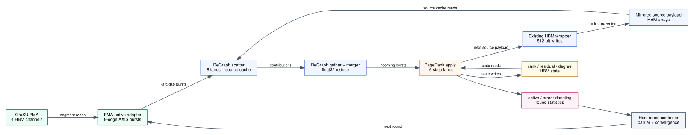

# GraSU/ReGraph PageRank Apply HLS Path

Date: 2026-07-26

## Claim class

This milestone is **functional HLS-shaped source evidence** for Full PageRank
and thresholded residual PageRank.  It implements the policy path that connects
ReGraph's existing gather/merger burst ABI to algorithm state and the next
round's source-property stream.  It is not a linked xclbin, measured FPGA
performance, or final iso-resource evidence.



## Reused versus replaced structure

The intended complete pipeline keeps these ReGraph modules:

- the PMA-native edge adapter;
- the eight-lane scatter and destination gather;
- the little-kernel merger;
- the source-property HBM wrapper and its mirrored source arrays.

The integration supplies two algorithm-specific pieces:

1. `include/regraph_pagerank/l2.h` makes scatter pass a float32 contribution
   and makes gather/merger perform float32 sum rather than the original PR
   UDF's fixed-point arithmetic;
2. `regraph_pagerank_apply` consumes each 512-bit merged incoming burst, reads
   rank/residual/out-degree, writes state, emits the next 512-bit source payload,
   and reports active count, error, and next dangling mass.

The output AXIS type is exactly ReGraph's existing `write_burst_pkt` ABI:
512-bit data, 32-bit destination burst index, and `TLAST`.  It can therefore
connect directly to `kernelHBMWrapper.prop_write_burst_stm` without an HBM
edge-array conversion.

## Full PageRank round

For each valid vertex:

```text
new_rank = base + dangling_share + incoming
next_source_payload = degree == 0 ? 0 : damping * new_rank / degree
next_dangling += degree == 0 ? new_rank : 0
error += abs(new_rank - old_rank)
```

The rank beat is written in place.  The next source payload is emitted to the
HBM wrapper, which mirrors it to the source arrays used by the scatter cache in
the next round.

## Thresholded residual PageRank round

The HLS path preserves the simulator's source-map/apply ordering.  At apply,
the residual that generated the current scatter payload is first consumed:

```text
old_active = abs(old_residual) > epsilon / vertices
rank_after_source = old_rank + (old_active ? old_residual : 0)
retained = old_active ? 0 : old_residual
next_residual = retained + incoming + dangling_share
next_active = abs(next_residual) > epsilon / vertices
next_source_payload = next_active && degree != 0
                    ? damping * next_residual / degree : 0
```

`next_residual` remains in state.  It is added to rank only when the next round
reaches apply, exactly once.  Inactive residual is retained rather than lost;
it may become active after later incoming or dangling redistribution.

## State and statistics

Full PageRank uses one 32-bit float rank word per vertex.  Residual PageRank
uses separate 32-bit rank and signed-residual arrays, for the same eight bytes
per vertex as the simulator's packed state.  Out-degree is a 32-bit word per
vertex maintained by the GraSU degree CU.

`round_stats` contains five 32-bit words:

| Index | Meaning |
|---:|---|
| 0 | status |
| 1 | active vertex count |
| 2 | float32 error sum bits |
| 3 | float32 next dangling mass bits |
| 4 | applied vertex count |

The apply loop accepts an explicit `burst_count`; this avoids hard-coding one
destination partition in the kernel.  If `vertices > 16 * burst_count`, status
is `kReGraphPageRankVertexCapacityExceeded` and the applied count is clamped to
the available bursts.

## Functional validation

```bash
cd /home/chuxiao/grasu-regraph-integration
scripts/check_regraph_pagerank_apply.sh \
  --out-dir .tmp_build/regraph_pagerank_apply_phase2_20260726
```

The three C-sim tests cover:

- Full PageRank rank update, next payload, error, dangling, padded lanes, and
  insufficient burst capacity;
- residual PageRank active/inactive handling, signed float state, dangling,
  next payload, and two consecutive rounds;
- the float32 scatter/gather UDF, including a negative contribution.

The script emits hashes and the claim class
`functional_policy_path_not_synthesized_hardware`.

## Remaining promotion gates

- generate and syntax-check Vitis compile/connectivity packets for both modes;
- connect merger -> PageRank apply -> HBM wrapper in `sw_emu`;
- add host round control and first-round source-payload initialization;
- compare every round's state and convergence decision against independent
  CPU float32 and mathematical oracles;
- synthesize to measure achieved apply II, floating-point resource cost,
  timing, and HBM port placement;
- reconcile the simulator's packed-state ports and the HLS separate-array
  ports before a matching-HLS performance claim;
- validate at least one dynamic update that changes out-degree and produces a
  signed residual.

Until those gates pass, cycle and speedup results remain simulator projections.
